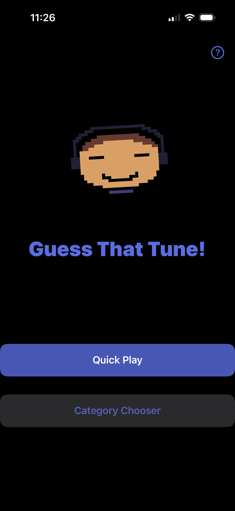
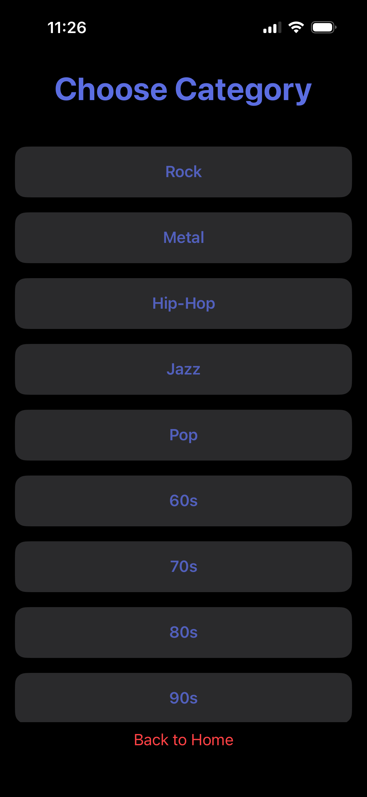
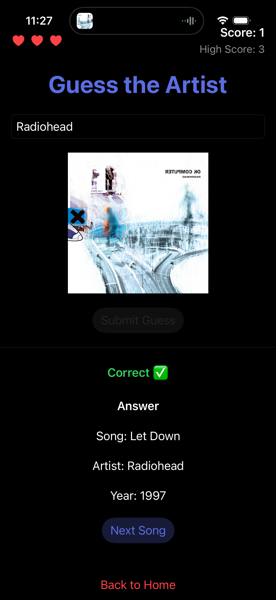

Guess That Tune
Overview
Guess That Tune is an interactive music game that connects to Spotify and challenges users to identify songs based on audio playback. Players guess the artist while managing lives and building a high score.

Features
Spotify authentication and integration
Play songs from curated playlists
Guess the artist
Lives system with heart indicators
Score and persistent high score tracking
Category-based gameplay (rock, pop, etc.)
Animated UI (rocking image, flip reveal)
Album artwork reveal after each guess
Custom Logo/Artwork

Technologies Used
Swift
SwiftUI
UIKit (integration where needed)
Spotify Web API
Spotify iOS SDK
OAuth 2.0 Authentication
URLSession (networking)
JSON decoding
UserDefaults (data persistence)
Adaptive Layouts
SwiftUI animations and transitions
Pixel Art
Game Logic Design

Demo Video

App Preview
## Screenshots

### Home Screen

### Category Selection

### Gameplay

Contact
LinkedIn: https://linkedin.com/in/Ryan-Bradshaw
Email: bradshr@bc.edu

